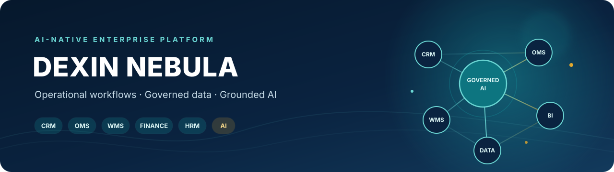

  

  
  
  
  

  <a href="./README.md">English</a> · <a href="./README.zh-CN.md">简体中文</a>

  <a href="https://nebula.dexinmiaosheng.cn"> 项目官网</a> ·
  <a href="./docs/ARCHITECTURE.md"> 系统架构</a> ·
  <a href="./docs/README.md"> 文档中心</a> ·
  <a href="./docs/portfolio/DEMO_GUIDE.md"> 演示指南</a> ·
  <a href="./docs/portfolio/CASE_STUDY.md"> 案例研究</a>

## 项目概述

德馨星云面向客户、订单、库存、财务、人事和文件流程分散在表格与独立工具中的内部企业团队。系统通过共享主数据、可审计状态流转、数据库强制权限和跨模块流程构成模块化全栈应用。AI 层基于用户有权访问的企业记录提供证据：当前已实现的助手能够检索有限上下文、引用来源并保持只读；受控智能体操作属于规划中的研究方向。

## 项目概览

<table>
  <tr>
    <td width="25%"> <strong>系统架构</strong> 具备明确领域边界的模块化单体</td>
    <td width="25%"> <strong>数据与安全</strong> PostgreSQL、RLS、事务与审计</td>
    <td width="25%"> <strong>AI 层</strong> 权限感知检索与来源引用</td>
    <td width="25%"> <strong>交付状态</strong> 内部 Alpha · <a href="https://nebula.dexinmiaosheng.cn">项目官网</a></td>
  </tr>
</table>

## 核心模块

<table>
  <tr>
    <td width="33%" align="center"> <strong>客户与收入</strong> <a href="./docs/modules/CRM.md">CRM</a> · <a href="./docs/modules/SALES.md">销售</a> · <a href="./docs/modules/OMS.md">OMS</a> 从客户关系到订单履约</td>
    <td width="33%" align="center"> <strong>供应链</strong> <a href="./docs/modules/PROCUREMENT.md">采购</a> · <a href="./docs/modules/WMS.md">WMS</a> 供应商、到货、库存与仓储执行</td>
    <td width="34%" align="center"> <strong>运营与智能</strong> <a href="./docs/modules/FINANCE.md">财务</a> · <a href="./docs/modules/HRM.md">HRM</a> · <a href="./docs/modules/OA.md">OA</a> · <a href="./docs/modules/BI.md">BI</a> 财务、人事、协同与经营分析</td>
  </tr>
</table>

<strong>查看模块状态与范围</strong>

| 模块 | 用途 | 状态 |
| --- | --- | --- |
| CRM | 客户、联系人、法律实体与关系管理 | 基础能力已实现 |
| 销售 | 商机、报价、产品与销售流程 | 基础能力已实现 |
| OMS | 订单生命周期、履约、配送和应收衔接 | 基础能力已实现 |
| 采购 | 供应商、申请、订单、到货和应付流程 | 基础能力已实现 |
| WMS | 批次库存、出入库、调拨、盘点和出库执行 | 基础能力已实现 |
| 财务 | 应收应付、核销、资金、发票和分析 | 进行中 |
| HRM | 组织、员工生命周期、考勤、请假和绩效 | 进行中 |
| OA | 审批、公告、周报、文件、通知和审计 | 基础能力已实现 |
| BI | 权限感知的运营与管理分析 | 进行中 |

## 为什么是 AI 原生

| 能力 | 状态 | 当前边界 |
| --- | --- | --- |
| 企业感知 AI 助手 | 已实现 | 登录态会话和安全失败处理 |
| 权限感知检索 | 已实现 | 有限结构化记录、已发布知识和文件元数据 |
| 基于证据的回答 | 已实现 | 来源引用和证据不足时的明确说明 |
| 意图路由与可观测性 | 基础能力已实现 | 确定性领域路由、检索审计、延迟和模型用量 |
| 语义检索与评估 | 进行中 | 已定义评估方法，尚无正式量化结果 |
| 工具调用与规划 | 规划中 | 受控工具结构和可检查计划尚未实现 |
| 人工批准的工作流操作 | 规划中 | 未来写操作需要确认、重新鉴权、事务和审计 |

详见 [AI 架构](./docs/AI_ARCHITECTURE.md)和[评估框架](./docs/EVALUATION.md)。

## 架构预览

~~~mermaid
flowchart TD
  U[已登录用户] --> UI[Next.js / React 界面]
  UI --> APP[应用层]
  APP --> MOD[企业业务模块]
  MOD --> CRM[CRM / 销售 / OMS]
  MOD --> SCM[采购 / WMS]
  MOD --> OPS[财务 / HRM / OA / BI]
  CRM & SCM & OPS --> DATA[(PostgreSQL + 行级安全策略)]
  UI --> AI[AI 助手]
  AI --> RET[意图路由 + 权限内检索]
  RET --> DATA
  RET --> MODEL[语言模型]
  MODEL --> AI
~~~

当前系统采用模块化单体架构。关键订单、库存、财务和审批操作使用服务端校验与数据库事务。详细说明见[系统架构](./docs/ARCHITECTURE.md)、[公开架构](./docs/portfolio/PUBLIC_ARCHITECTURE.md)和[架构决策](./docs/DECISIONS.md)。

## 技术栈

| 领域 | 实际使用技术 |
| --- | --- |
| 前端 | Next.js 16 App Router、React 19、TypeScript、Tailwind CSS 4、Base UI、Recharts |
| 后端 | Next.js Server Actions 与 Route Handlers、Zod 校验 |
| 数据与身份 | PostgreSQL、Supabase Auth、Supabase SSR/JS、行级安全策略、SQL 迁移 |
| AI | 服务端语言模型接入、确定性意图路由、权限感知 RAG |
| 文件与导出 | 服务端代理的私有文件存储、ExcelJS |
| 测试 | ESLint、TypeScript、Node 测试运行器、生产构建 |
| 部署 | TLS 反向代理后的 Node.js 服务和按环境隔离的托管服务 |

## 开发者快速开始

 <strong>本地开发需要 Node.js 22 LTS 与 npm 10 或更高版本。</strong>

~~~bash
npm ci
cp .env.example .env.local
npm run dev
~~~

仅使用开发环境凭证与合成数据。发布前运行 `npm run check`、`npm run test:workflow` 和 `npm run build`。环境、数据库和工作流约定详见[开发指南](./docs/engineering/DEVELOPMENT.md)。

## 工程与研究重点

项目探索模块化企业架构、关系型工作流建模、分层权限、事务一致性、权限感知检索、可信 AI 行为、工具选择准确性、人机协作和长周期智能体可靠性。这些是工程与研究问题；德馨星云不被描述为已经发表的学术研究。

通用智能体接口、检索工具、工作流基础能力、评估工具和 UI 组件未来可在完成依赖、安全与权属审查后拆分到独立仓库，但不会因存在于本项目中而自动开源或变更许可证。

## 产品预览

[项目官网](https://nebula.dexinmiaosheng.cn)提供产品层面的公开介绍。在完成全合成数据集和隐私审查前，仓库文档暂不放置业务截图。[演示指南](./docs/portfolio/DEMO_GUIDE.md)定义了 Dashboard、CRM、订单、采购、仓储、审批、搜索、AI 和审计能力的安全演示顺序。

## 项目状态

**状态：持续开发——内部 Alpha 与业务验证阶段。**

- **已实现：**核心模块页面和数据模型、分层权限、主要销售/采购/库存/审批流程、全局搜索和只读可信 AI。
- **进行中：**业务验收、高级财务边界、退货与异常处理、检索评估、可观测性和公开合成演示材料。
- **规划中：**受控智能体工具、人工批准的写操作、语义检索、可复用分析读模型和受控自动化。

详见[里程碑路线图](./docs/ROADMAP.md)。

## 安全与隐私

系统通过认证后的服务端操作、数据范围控制、PostgreSQL 行级策略、私有文件代理、输入校验、事务控制和审计记录建立安全边界。仓库文档和公开演示不得暴露真实企业或员工数据、凭证、机密财务数据或私有基础设施；公开展示必须使用合成数据。

## 文档

- [项目总览](./docs/PROJECT.md)
- [产品需求](./docs/PRD.md)
- [系统架构](./docs/ARCHITECTURE.md)
- [AI 架构](./docs/AI_ARCHITECTURE.md)
- [路线图](./docs/ROADMAP.md)
- [工程决策](./docs/DECISIONS.md)
- [评估框架](./docs/EVALUATION.md)
- [案例研究](./docs/portfolio/CASE_STUDY.md)

## 许可证与源码开放说明

<table>
  <tr>
    <td width="33%"><strong>专有产品</strong> DEXIN NEBULA 采用保留所有权利的专有许可证。</td>
    <td width="33%"><strong>受控源码开放</strong> 仓库用于文档、作品集审阅、演示和评估；获得访问权限不代表获得复用权。</td>
    <td width="34%"><strong>独立通用组件</strong> 部分通用组件可在完成权属和安全审查后拆分并使用独立许可证。</td>
  </tr>
</table>

生产源码、核心业务逻辑、企业数据、凭证和涉及安全的实现细节保持私有。详见完整[专有许可证](./LICENSE)与[第三方声明](./THIRD_PARTY_NOTICES.md)。

## 项目归属

Copyright © 2026 Felix Yang / DEXIN NEBULA。公开材料中的产品名称和记录必须为合成内容，或已经明确获准公开。
